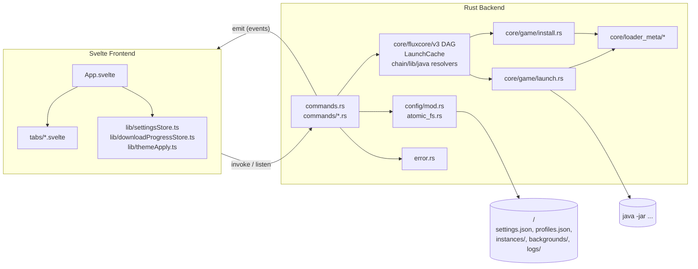
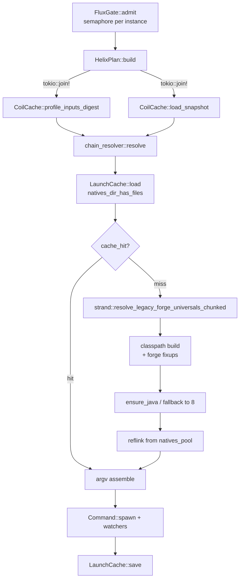

# Архитектура JentleMemes Launcher

## Высокоуровневая схема



## IPC-контракт

- Сторона Rust: `#[tauri::command]` функции в `commands.rs` и `commands/*.rs`. Сериализация ошибок — через `impl Serialize for Error` → `{ message, detail }`, где `message` показывается пользователю, а `detail` — для логов/багрепортов (см. [`src-tauri/src/error.rs`](../src-tauri/src/error.rs)).
- Алиас `CmdResult<T> = Result<T, Error>` — паттерн для новых команд, убирает `map_err(|e| e.to_string())`.
- Фронт: `invoke<T>("name", args)` + `listen<Payload>("event", handler)`.
- Единый writer настроек — команда `patch_settings(delta)`. Остальные вкладки не должны читать `load_settings` → мутировать → `save_settings`, чтобы не ловить гонки.

## FluxCore v3 — конвейер запуска



Ключевые инварианты:

- `LaunchCache` хранит `chain_hash`, `settings_hash`, `classpath`, `java_path`, `asset_index`. На тёплом запуске совпадение хешей пропускает forge-universals resolve, промоушен ForgeWrapper → Bootstrap и (опционально) обновление каталога natives.
- `resolve_legacy_forge_universals_chunked` вызывается также из `install::download_game_files`, поэтому при первой установке сборки cold-path в `launch` короче.
- `LogFlushGuard` в `launch.rs` буферизует `app.emit("log_<id>", ...)` до 8 строк / 150 мс; финальный flush — через `Drop`.

## Логирование

- `tracing` + `tracing-subscriber` + `tracing-appender` инициализируются в `main::init_tracing`.
- Файл: `<data_dir>/logs/launcher.YYYY-MM-DD.log`, ежедневная ротация.
- Уровень: `JM_LOG=debug` / `JM_LOG=info,jentlememes_launcher::core::fluxcore=debug`.
- Каждый запуск стартует структурированный span `FluxCore v3`.

## Sandbox / безопасность

- Все IPC-команды с аргументом-путём используют `core::utils::path_guard::sanitize_path_within(raw, allowed_root)`. Примеры: `delete_background`, `read_local_image_data_url`.
- CSP в [`tauri.conf.json`](../src-tauri/tauri.conf.json) запрещает `http:` в `connect-src` / `frame-src` / `worker-src` / `media-src` / `font-src`. `https:` оставлен широким: интернал лаунчера (Modrinth, CurseForge, Mojang, Ely.by) + пользовательские плейсхолдеры.
- `assetProtocol.scope` пока `**/*` — требуется сужение с учётом per-user `<data_dir>` (follow-up PR).

## Тестирование

- Rust-тесты: `cargo test --bin jentlememes-launcher`. Текущее покрытие: `path_guard`, `version_sort`, `atomic_fs`.
- Frontend: `vitest` (требуется `npm install -D vitest`). Тесты в `src/**/*.test.ts`.
- CI: [`.github/workflows/ci.yml`](../.github/workflows/ci.yml) — `fmt/clippy/test/check/build` на `ubuntu-latest` и `windows-latest`.

## Структура каталога данных

```
~/.jentlememes_data/          # или XDG_DATA_HOME на Linux
├── settings.json             # LauncherSettings (атомарная запись)
├── settings.json.bak         # автоматический бэкап перед каждой записью
├── profiles.json             # аккаунты + скины
├── backgrounds/              # пользовательские обои
├── instances/<id>/
│   ├── instance.json
│   ├── launch_cache.json     # FluxCore warm-path (chain_hash, classpath, java_path)
│   ├── .fluxcore/coil_snapshot.json
│   ├── mods/, resourcepacks/, saves/, natives/
│   └── pack_source.json
├── versions/<profile_id>/
├── libraries/
├── assets/
├── java/                     # скачанные JRE
└── logs/
    └── launcher.YYYY-MM-DD.log
```
