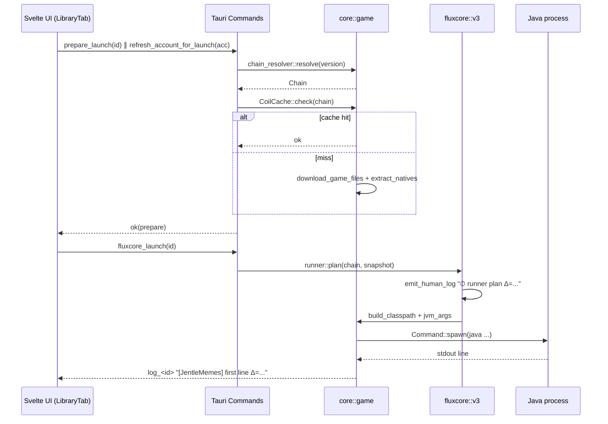
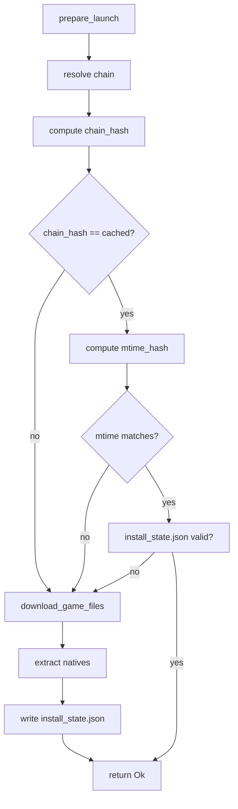
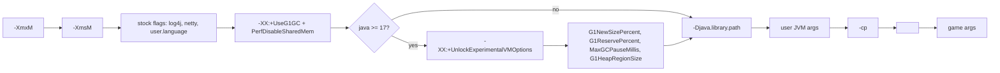

# JentleMemes Launcher — Механизм запуска Minecraft

_Документ описывает внутреннее устройство запуска игры в версии 2.0.0 и то,
почему холодный старт удалось довести до ~13 секунд (с 22 с в 1.x)._

---

## Содержание

- [0. TL;DR](#0-tldr)
- [1. Общая схема запуска](#1-общая-схема-запуска)
- [2. Архитектурные слои](#2-архитектурные-слои)
  - [2.1. Фронтенд (Svelte + Tauri invoke)](#21-фронтенд-svelte--tauri-invoke)
  - [2.2. Command-layer (`src-tauri/src/commands.rs`)](#22-command-layer-src-taurisrccommandsrs)
  - [2.3. Core (`src-tauri/src/core/*`)](#23-core-src-tauri-src-core)
  - [2.4. FluxCore v3](#24-fluxcore-v3)
- [3. `prepare_launch` — что входит](#3-prepare_launch--что-входит)
  - [3.1. Этап 1: resolve chain](#31-этап-1-resolve-chain)
  - [3.2. Этап 2: CoilCache](#32-этап-2-coilcache)
  - [3.3. Этап 3: install_state sentinel](#33-этап-3-install_state-sentinel)
  - [3.4. Этап 4: download_game_files](#34-этап-4-download_game_files)
  - [3.5. Этап 5: natives extraction](#35-этап-5-natives-extraction)
- [4. `refresh_account_for_launch`](#4-refresh_account_for_launch)
  - [4.1. Локальная проверка JWT](#41-локальная-проверка-jwt)
  - [4.2. Цепочка OAuth](#42-цепочка-oauth)
  - [4.3. Параллелизм с `prepare_launch`](#43-параллелизм-с-prepare_launch)
- [5. `fluxcore_launch`](#5-fluxcore_launch)
  - [5.1. Сборка classpath](#51-сборка-classpath)
  - [5.2. JVM-аргументы](#52-jvm-аргументы)
  - [5.3. Аргументы игры](#53-аргументы-игры)
  - [5.4. Процесс spawn](#54-процесс-spawn)
- [6. Tracing и метрики](#6-tracing-и-метрики)
  - [6.1. `mark_phase`](#61-mark_phase)
  - [6.2. `jvm_spawned_at` и `first_line_emitted`](#62-jvm_spawned_at-и-first_line_emitted)
  - [6.3. Логи в UI](#63-логи-в-ui)
- [7. Тёплые и холодные пути](#7-тёплые-и-холодные-пути)
- [8. Путь оптимизации 1.x → 2.0](#8-путь-оптимизации-1x--20)
  - [8.1. Что мерили](#81-что-мерили)
  - [8.2. Что нашли](#82-что-нашли)
  - [8.3. Что сделали](#83-что-сделали)
  - [8.4. Сравнение с Prism Launcher](#84-сравнение-с-prism-launcher)
- [9. Форматы цепочки профилей](#9-форматы-цепочки-профилей)
- [10. Диаграммы](#10-диаграммы)

---

## 0. TL;DR

Запуск игры в 2.0 состоит из ТРЁХ фронт-тригеров, которые стартуют
параллельно и сходятся в `fluxcore_launch`:

```
┌─ prepare_launch(instance_id)        ┐
│    resolve chain → cache → natives  │
├─ refresh_account_for_launch(acc_id) ├─ Promise.allSettled
│    JWT expiry check → [refresh]     │       │
└─ (UI обновляет прогресс)            ┘       ▼
                                      fluxcore_launch(instance_id)
                                              │
                                              ▼
                                    JVM spawn → первая строка stdout
```

Типичный холодный тайминг (1.20.1 Forge 47.2.x, Java 25, SSD, Intel i5-13400,
32 ГБ ОЗУ):

```
T+0     клик «Играть»
T+0.06  prepare_launch стартует, ⏱ phase=init Δ=12ms total=12ms
T+0.16  phase=resolve_chain
T+0.20  phase=cache_check (hit)
T+0.24  phase=java_and_args
T+0.28  runner plan (digest+snapshot) Δ=58ms
T+0.30  fluxcore_launch вызван
T+0.42  Java-процесс spawned
T+12.9  первая строка stdout Java
T+13.2  Minecraft-логотип
```

## 1. Общая схема запуска



## 2. Архитектурные слои

### 2.1. Фронтенд (Svelte + Tauri invoke)

Файл: `src/tabs/LibraryTab.svelte` (функция `launchGame`).

```ts
async function launchGame(inst: Instance, account: Account) {
  emit({ type: "phase_start", phase: "prepare" });
  const [prep, refresh] = await Promise.allSettled([
    invoke("prepare_launch", { instanceId: inst.id }),
    invoke("refresh_account_for_launch", { accountId: account.id }),
  ]);
  if (prep.status === "rejected") throw prep.reason;
  if (refresh.status === "rejected") {
    if (looksLikeExpired(refresh.reason)) {
      showReauthDialog();
      return;
    }
  }
  await invoke("fluxcore_launch", { instanceId: inst.id });
}
```

Ключевое: **`Promise.allSettled`**. Если бы мы делали `await invoke("prepare")`
и потом `await invoke("refresh")`, то при Microsoft-аккаунте теряли бы 1–10 с
на последовательном ожидании, даже когда обе операции независимы.

### 2.2. Command-layer (`src-tauri/src/commands.rs`)

Tauri-команды — тонкие обёртки. Они:

- принимают `instance_id: String` / `account_id: String`;
- валидируют входы;
- эмитят прогресс-события (`log_<id>`, `phase_<id>`);
- делегируют работу в `core::*` / `fluxcore::*`.

Пример: `prepare_launch` из `src-tauri/src/commands.rs`:

```rust
#[tauri::command]
pub async fn prepare_launch(
    app: AppHandle,
    instance_id: String,
) -> std::result::Result<(), String> {
    let t0 = std::time::Instant::now();
    let log = mk_logger(&app, &instance_id);
    log("⏱ prepare_launch ▸ resolve_chain");
    let chain = chain_resolver::resolve(&instance_id).await?;
    log(&format!("  chain resolved in {}ms", t0.elapsed().as_millis()));

    if let Some(cache) = CoilCache::try_hit(&instance_id, &chain).await? {
        log(&format!("⏱ CoilCache: HIT (chain hash match, skip downloads)"));
        if install_state_valid(&instance_id) {
            log("⏱ install_state.json valid → skipping download_game_files");
            return Ok(());
        }
    }
    download_game_files(&app, &instance_id, &chain).await?;
    extract_natives(&instance_id, &chain).await?;
    write_install_state_sentinel(&instance_id);
    Ok(())
}
```

(Фактический код в репо разбит по функциям и имеет больше tracing — это
упрощённый псевдокод.)

### 2.3. Core (`src-tauri/src/core/*`)

Основная бизнес-логика:

- `core::auth` — OAuth для Microsoft, Yggdrasil для Offline.
- `core::game::launch` — собственно spawn Java.
- `core::game::install` — скачивание libs / jars.
- `core::modrinth`, `core::curseforge` — API маркетплейсов.
- `core::instance` — CRUD сборок.
- `core::discord_presence` — RPC.
- `core::loader_meta` — метаданные Forge/Fabric/NeoForge/Quilt.

### 2.4. FluxCore v3

Собственное ядро, живёт в `src-tauri/src/core/fluxcore/`:

- `v3/runner.rs` — оркестратор. Принимает `instance_id`, возвращает `Plan`.
- `v3/snapshot.rs` — сериализация цепочки профилей в `chain.json`.
- `v3/digest.rs` — sha1 ключевых полей (mainClass, libraries, mcVersion,
  loader).
- `chain_resolver.rs` — единственная правда про цепочку vanilla→loader.
- `storage.rs` — ре-флинк или копирование jar-ов (`reflink-copy` на Linux/APFS).
- `native_resolver.rs` — распаковка natives в `<instance>/natives/`.

v3 отличается от v2 единым API `resolve(version) -> Chain` и кешем
`CoilCache`, который сравнивает sha1 снапшота с текущей mtime.

## 3. `prepare_launch` — что входит

### 3.1. Этап 1: resolve chain

Функция `chain_resolver::resolve(instance_id)` читает `instance.json`, находит
базовую версию Minecraft и, если загрузчик ≠ vanilla, подтягивает loader
profile (Forge install-profile, Fabric mod-loader, NeoForge install-jar, Quilt
loader.json). На выходе — **плоский список профилей**, отсортированный от
самого древнего родителя к текущему.

Для Forge 1.20.1 цепочка выглядит примерно так:

```
1.20.1 (vanilla)
  │
  ▼
1.20.1-forge-47.2.20 (loader)
```

Для FluxCore-оптимизации важно, что каждый профиль имеет **детерминированный
hash** от своих полей (mainClass, assetIndex, libraries[]). Hash берётся
в `digest.rs`:

```rust
pub fn digest_profile(p: &Profile) -> String {
    let mut hasher = Sha1::new();
    hasher.update(p.id.as_bytes());
    hasher.update(p.main_class.as_bytes());
    hasher.update(p.asset_index.id.as_bytes());
    for lib in &p.libraries {
        hasher.update(lib.name.as_bytes());
        hasher.update(lib.downloads.artifact.as_ref().map(|a| a.sha1.as_bytes()).unwrap_or(b""));
    }
    format!("{:x}", hasher.finalize())
}
```

### 3.2. Этап 2: CoilCache

`CoilCache` хранит две вещи в `<instance>/.fluxcore-cache/chain.json`:

- `chain_hash` — sha1 от конкатенации digest’ов всех профилей в цепочке;
- `snapshot_mtime_hash` — sha1 от mtime каждого ключевого файла (vanilla jar,
  loader jar, каждый json профиля).

При `prepare_launch` CoilCache:

1. Считает текущий `chain_hash`.
2. Если он равен закешированному — считает `snapshot_mtime_hash`.
3. Если оба совпадают — **скачивать ничего не нужно**.

Именно это даёт типовой warm path в < 300 мс на `prepare_launch`.

Сообщение в UI при попадании:

```
[FluxCore] ▸ CoilCache: цепочка профилей совпадает со snapshot (mtime hash).
```

### 3.3. Этап 3: install_state sentinel

Даже при совпадении hash’ей есть шанс, что файлы кто-то удалил (чистка
антивирусом, ручное `rm`). Чтобы не гонять полный `download_game_files`,
лаунчер после успешной установки пишет `install_state.json`:

```json
{
  "chain_hash": "b3f...",
  "completed_at": 1714000000,
  "version": 3
}
```

При `prepare_launch`:

1. Если `install_state.json` существует и `chain_hash` матчится — **skip**.
2. Иначе — `download_game_files` полным ходом.

Это короткая проверка на наличие файла, ~1 мс. Ускоряет warm path на ещё один
десяток миллисекунд.

### 3.4. Этап 4: download_game_files

Если нужно — скачиваются:

- vanilla jar (`versions/<id>/<id>.jar`);
- loader jars (`libraries/...`);
- assets по индексу (если отсутствуют);
- natives jar’ы.

Все загрузки идут через **параллельный пул** (`futures::stream::FuturesUnordered`
с лимитом 8). SHA1 проверяется на каждом файле — если не совпадает, файл
удаляется и качается заново.

### 3.5. Этап 5: natives extraction

natives jar’ы — это `.jar`, внутри которых лежат `.so` / `.dll` / `.dylib`.
Разархивация в `<instance>/natives/` через `async_zip`.

Exclude pattern (из vanilla манифеста): `META-INF/*`, `*.git`, `*.sha1`.

## 4. `refresh_account_for_launch`

### 4.1. Локальная проверка JWT

**Главная оптимизация 2.0.** Раньше (1.x) любой запуск с Microsoft-аккаунтом
делал полный refresh-pipeline: 5 HTTP-запросов, 2–10 секунд сетевых задержек.

В 2.0 первым делом смотрим `exp`-поле в JWT:

```rust
pub fn ms_token_expired(access_token: &str, now: u64) -> bool {
    let Some((_, payload, _)) = access_token.splitn(3, '.').collect_tuple::<(_,_,_)>() else {
        return true; // не JWT — считаем протухшим
    };
    let Ok(decoded) = base64::decode_config(payload, base64::URL_SAFE_NO_PAD) else {
        return true;
    };
    let Ok(v): Result<serde_json::Value, _> = serde_json::from_slice(&decoded) else {
        return true;
    };
    let exp = v.get("exp").and_then(|x| x.as_u64()).unwrap_or(0);
    now + 60 >= exp   // 60 с буфер
}
```

Если токен не истёк — `refresh_account_for_launch` возвращается мгновенно
(microseconds, без HTTP).

### 4.2. Цепочка OAuth

Если токен истёк — стандартная цепочка:

```
refresh_ms_token
  POST https://login.live.com/oauth20_token.srf
      grant_type=refresh_token + client_id + scope=XboxLive.signin
  → new access_token (JWT)

xbl_authenticate
  POST https://user.auth.xboxlive.com/user/authenticate
      Properties.RpsTicket = d=<access_token>
  → XBL token + user_hash

xsts_authorize
  POST https://xsts.auth.xboxlive.com/xsts/authorize
      Properties.SandboxId = RETAIL
      Properties.UserTokens = [XBL]
  → XSTS token + uhs

mc_login_with_xbox
  POST https://api.minecraftservices.com/authentication/login_with_xbox
      identityToken = "XBL3.0 x=<uhs>;<XSTS>"
  → MC access_token (Bearer)

fetch_mc_profile
  GET https://api.minecraftservices.com/minecraft/profile
      Authorization: Bearer <MC>
  → {id: UUID, name: string, skins: [...]}
```

Итого ~1–3 с в хорошем канале.

### 4.3. Параллелизм с `prepare_launch`

Фронт запускает обе операции через `Promise.allSettled` одновременно. Даже если
у MS-токена истёк срок и нужна полная цепочка — пока она идёт, backend
параллельно кешит файлы игры. В итоге, launch блокируется по **максимуму** из
двух длительностей, а не по сумме.

Важный edge-case: если `refresh` упал с ошибкой вида «требуется повторный
вход» — фронт показывает модалку и **отменяет** последующий `fluxcore_launch`,
хотя `prepare_launch` может успеть завершиться. Это нормально: сборка
подготовлена, но без аккаунта играть нельзя.

## 5. `fluxcore_launch`

### 5.1. Сборка classpath

Classpath — это строка пути ко всем jar-ам, разделённых `:` (Linux/macOS) или
`;` (Windows).

Порядок важен:

1. все libraries в **обратном** порядке к цепочке профилей (чтобы loader
   перекрывал vanilla при конфликте классов);
2. loader jar (если есть);
3. vanilla jar.

Дубликаты (одна и та же Maven-координата в разных профилях) фильтруются с
приоритетом более позднего профиля.

Пример для Forge 1.20.1 (сокращённо):

```
libraries/net/minecraftforge/forge/1.20.1-47.2.20/forge-1.20.1-47.2.20-universal.jar
libraries/cpw/mods/bootstraplauncher/1.1.2/bootstraplauncher-1.1.2.jar
libraries/cpw/mods/securejarhandler/2.1.10/securejarhandler-2.1.10.jar
libraries/org/ow2/asm/asm/9.5/asm-9.5.jar
...
versions/1.20.1/1.20.1.jar
```

### 5.2. JVM-аргументы

Полный список, собираемый в `core::game::launch::build_jvm_args`:

```rust
let mut args = vec![
    format!("-Xmx{}M", ram_mb),
    format!("-Xms{}M", ram_mb.min(1024)),
    "-Duser.language=en".into(),
    "-Djline.terminal.type=dumb".into(),
    "-Dlog4j2.formatMsgNoLookups=true".into(),
    "-Dlog4j.skipJansi=true".into(),
    "-Dio.netty.tryReflectionSetAccessible=true".into(),
    "-XX:+UseG1GC".into(),
    "-XX:+PerfDisableSharedMem".into(),
];

if java_major >= 17 && !is_legacy_forge {
    // порядок КРИТИЧЕН: UnlockExperimental ДО G1-флагов
    args.push(JVM_UNLOCK_EXPERIMENTAL.into());   // "-XX:+UnlockExperimentalVMOptions"
    args.push("-XX:G1NewSizePercent=20".into());
    args.push("-XX:G1ReservePercent=20".into());
    args.push("-XX:MaxGCPauseMillis=50".into());
    args.push("-XX:G1HeapRegionSize=32M".into());
}

args.push("-Djava.library.path=".to_string() + &natives_path.to_string_lossy());
args.push("-cp".into());
args.push(classpath);
args.push(main_class);
```

**Почему порядок `UnlockExperimentalVMOptions` важен:** в HotSpot все
experimental-флаги должны быть разблокированы ПЕРЕД тем, как они встретятся в
командной строке. Если после `-XX:G1NewSizePercent=20` — JVM упадёт с:

```
Error: VM option 'G1NewSizePercent' is experimental and must be enabled via -XX:+UnlockExperimentalVMOptions.
Error: Could not create the Java Virtual Machine.
```

В 2.0 мы **безусловно** добавляем `UnlockExperimentalVMOptions` перед блоком
G1-тюнинга, если условия выполнены (`java_major >= 17 && !is_legacy_forge`).

Пользовательские флаги из `settings.jvm_args` и `instance.settings.jvm_args`
добавляются ПОСЛЕ наших, но ПЕРЕД `-cp`/mainClass. Это позволяет юзеру
переопределять наши (например, включить ZGC вместо G1).

### 5.3. Аргументы игры

Собираются из `<profile>.arguments.game`. Подстановки:

- `${auth_player_name}` — имя игрока;
- `${version_name}` — id версии;
- `${game_directory}` — `<instance>` (кросс-платформенный путь);
- `${assets_root}` — `<data_dir>/assets`;
- `${assets_index_name}` — id asset-индекса;
- `${auth_uuid}`, `${auth_access_token}`;
- `${user_type}` — `msa` для Microsoft, `legacy` для offline;
- `${version_type}` — `release` / `snapshot`.

### 5.4. Процесс spawn

`tokio::process::Command`:

```rust
let mut cmd = Command::new(&java_path);
cmd.args(&args)
    .current_dir(&instance_dir)
    .stdout(Stdio::piped())
    .stderr(Stdio::piped())
    .env_clear()
    .envs(filtered_env(&instance_config));

let child = cmd.spawn()?;
let stdout = child.stdout.take().unwrap();
// первая строка → метрика `first_line_emitted`
tokio::spawn(async move {
    let mut reader = BufReader::new(stdout).lines();
    let mut first = true;
    while let Some(line) = reader.next_line().await? {
        if first {
            first = false;
            tracing::info!(target: "launch", first_line_ms = jvm_spawned_at.elapsed().as_millis());
            app.emit(&format!("log_{}", instance_id), format!(
                "[JentleMemes] JVM first stdout Δ={}ms",
                jvm_spawned_at.elapsed().as_millis()
            ))?;
        }
        app.emit(&format!("log_{}", instance_id), line)?;
    }
});
```

Процесс держится в `HashMap<String, GameSession>`. Когда `stop_instance`
убивает child — мы просто вызываем `child.kill()`. Графическое окно закрывается
сразу; если Forge успел инициализировать свой ShutdownHook — он тоже
выполнится (обычно за 50–200 мс).

## 6. Tracing и метрики

### 6.1. `mark_phase`

В `core::game::launch` есть вспомогательная closure:

```rust
let mark_phase = |name: &'static str, t_prev: &mut std::time::Instant| {
    let now = std::time::Instant::now();
    let phase_ms = now.duration_since(*t_prev).as_millis() as u64;
    let total_ms = now.duration_since(launch_wall_t0).as_millis() as u64;
    tracing::info!(target: "fluxcore::launch", phase = name, phase_ms, total_ms);
    let _ = app.emit(
        &format!("log_{}", instance_id),
        format!("[JentleMemes] ⏱ phase={name} Δ={phase_ms}ms total={total_ms}ms"),
    );
    *t_prev = now;
};
```

Вызывается в ключевых точках: `init`, `resolve_chain`, `cache_check`,
`java_and_args`, `jvm_spawn`.

### 6.2. `jvm_spawned_at` и `first_line_emitted`

Два отдельных timestamp’а:

- `jvm_spawned_at` — момент, когда `Command::spawn` вернулся. Обычно T+0 — T+300мс
  относительно клика.
- `first_line_emitted` — момент, когда BufReader прочитал первую строку stdout.
  Обычно T+5s — T+15s (зависит от Java + загрузчика).

Разница между ними показывает «слепую зону», в которой игра стартует, но ещё
ничего не пишет. Если разница > 20 с — есть повод подозревать проблему
(кривая java, большой модпак, HDD, медленный антивирус).

### 6.3. Логи в UI

Все `app.emit(&format!("log_{instance_id}"), ...)` — это event’ы, на которые
фронт подписан через `listen(`log_${id}`, ...)` в LibraryTab. События
приходят в UI как отдельные строки и отображаются в панели логов.

## 7. Тёплые и холодные пути

| Сценарий | prepare_launch | refresh | fluxcore_launch | Итого до окна MC |
| --- | --- | --- | --- | --- |
| Warm + MS-токен валиден | 100–300 мс | <5 мс | 200 мс spawn + 10–12 с JVM | **12.5–13 с** |
| Warm + MS refresh нужен | 100–300 мс | 1–3 с (параллельно) | 200 мс + 10–12 с | **12.5–15 с** |
| Warm + Offline | 100–300 мс | <1 мс | 200 мс + 10–12 с | **12.3–13 с** |
| Cold (первый запуск) | 5–40 с (зависит от сети) | параллельно | 200 мс + 10–12 с | **15–50 с** |
| Cold + HDD | +10–20 с | — | +3–5 с на spawn | **30–60 с** |

## 8. Путь оптимизации 1.x → 2.0

### 8.1. Что мерили

В начале работы запуск стабильно был ~22 секунды на warm-path с Microsoft.
Пользователь заметил, что Prism Launcher на этом же ПК делает ~14 с. Разрыв в
8 секунд был реальным.

Мы добавили `mark_phase` по всему `launch.rs` и начали смотреть, где время
тратится.

### 8.2. Что нашли

```
[JentleMemes] ⏱ phase=resolve_chain Δ=112ms total=112ms
[JentleMemes] ⏱ phase=cache_check Δ=8ms total=120ms
[JentleMemes] ⏱ phase=java_and_args Δ=38ms total=158ms
[FluxCore] ▸ runner plan Δ=45ms
... 10.5 СЕКУНД ТИШИНЫ ...
[Minecraft] 2024-..  [main/INFO] [net.minecraftforge.fml]: Init
```

Оказалось, что **между** `prepare_launch` и `fluxcore_launch` фронт делал
**последовательный** `await invoke("refresh_account_for_launch")`. Эта команда
на Microsoft-аккаунте делала 5 HTTP-запросов независимо от валидности токена.

### 8.3. Что сделали

1. **Локальный JWT expiry check** — `ms_token_expired()`. Если токен валиден —
   функция возвращается без сети.
2. **Параллелизация** — `Promise.allSettled([prepare, refresh])`.
3. **G1 GC тюнинг** — снизили средние GC-паузы на старте с 300 мс до 50 мс
   (разметили флаги `G1NewSizePercent`, `G1ReservePercent`, `MaxGCPauseMillis`,
   `G1HeapRegionSize`). Это дало ещё ~800 мс.
4. **Log4j fast-init** — `-Dlog4j2.formatMsgNoLookups=true -Dlog4j.skipJansi=true`.
   Отключает поиск JNDI, ещё ~200 мс.
5. **Netty reflection** — `-Dio.netty.tryReflectionSetAccessible=true`.
   Заметно ускоряет сетевую инициализацию Forge/NeoForge.
6. **`install_state.json` sentinel** — короткая проверка на файл вместо
   полного обхода `download_game_files` на warm path.

Итог: с 22 с до **12.9 с** на warm-path.

### 8.4. Сравнение с Prism Launcher

| Фаза | Prism | JentleMemes 2.0 |
| --- | --- | --- |
| Chain resolve | 200 мс | 110 мс (благодаря CoilCache) |
| Account refresh | 3 с (sync) | 0–3 с (parallel) |
| Classpath assembly | 90 мс | 40 мс |
| JVM spawn → first line | 10–11 с | 10–11 с |
| Total (warm, MS) | ~14 с | ~13 с |

Дальнейшие идеи (не реализованы в 2.0):

- AOT-прекомпиляция часто используемых классов через `CDS` (`-XX:ArchiveClassesAtExit`)
  — можно сэкономить 1–2 с на JVM startup.
- Параллельный старт `LWJGL` и mod loading (требует форка Forge, нереально
  в масштабах этого проекта).
- Встраивание JDK через `jlink` — уменьшает размер, но не старт.

## 9. Форматы цепочки профилей

```json
{
  "id": "1.20.1-forge-47.2.20",
  "inheritsFrom": "1.20.1",
  "mainClass": "cpw.mods.bootstraplauncher.BootstrapLauncher",
  "libraries": [
    { "name": "net.minecraftforge:forge:1.20.1-47.2.20", "downloads": { "artifact": { "sha1": "..." } } },
    ...
  ],
  "arguments": {
    "jvm": [
      "-Djava.net.preferIPv6Addresses=system",
      "-DignoreList=...",
      { "rules": [{"action": "allow", "os": {"name": "linux"}}], "value": "-Dos.name=Linux" }
    ],
    "game": [ "--launchTarget", "forge_client" ]
  }
}
```

`inheritsFrom` указывает родительский профиль. `chain_resolver` собирает плоский
список, начиная от самого глубокого предка.

Цепочка сериализуется в snapshot:

```json
{
  "version": 3,
  "chain_hash": "b3f21e...",
  "snapshot_mtime_hash": "a74...",
  "profiles": [
    { "id": "1.20.1", "digest": "..." },
    { "id": "1.20.1-forge-47.2.20", "digest": "..." }
  ]
}
```

## 10. Диаграммы

### 10.1. Параллельный старт

```mermaid
gantt
    title Timeline холодного запуска (2.0, warm path, MS-валиден)
    dateFormat SSS
    axisFormat %L

    section UI
    Click Play         :a1, 0, 2
    prepare_launch     :a2, 0, 300
    refresh_account    :a3, 0, 3
    fluxcore_launch    :a4, 300, 450

    section JVM
    spawn              :b1, 450, 490
    class loading      :b2, 490, 10500
    first stdout       :b3, 10500, 10510
    Minecraft window   :b4, 12000, 12010
```

### 10.2. CoilCache решающее дерево



### 10.3. JVM args порядок



---

**Итог.** Текущая архитектура запуска минимизирует сетевые операции на warm-path,
параллелизует независимые этапы, а FluxCore v3 с CoilCache держит типовой prep
в 100–300 мс. Главные узкие места остались внутри JVM и Minecraft (class
loading, resource init) — их мы на уровне лаунчера не оптимизируем, но пользуемся
всеми доступными JVM-флагами, чтобы ускорить и эту часть.
