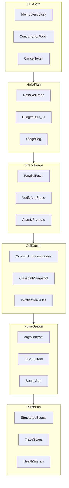
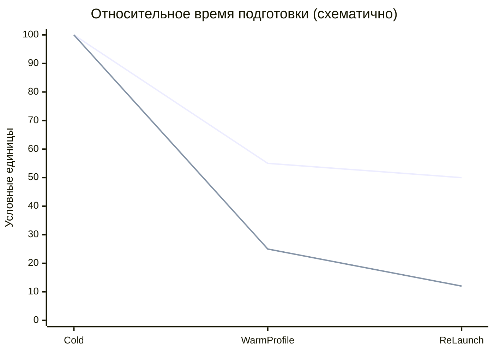

# FluxCore v3 — аудит v2 и целевая архитектура

Инженерная спецификация для лаунчера JentleMemes. Цифры на диаграммах ниже **схематичны**; после внедрения PulseBus их следует заменить измерениями.

## Резюме

**FluxCore v2** в коде — это в основном [`src-tauri/src/core/fluxcore/conductor.rs`](../src-tauri/src/core/fluxcore/conductor.rs): семафор на инстанс, проверка «уже запущено», лог через `emit`, вызов `install::promote_forge_wrapper_to_bootstrap`, затем **полное делегирование** в [`src-tauri/src/core/game/launch.rs`](../src-tauri/src/core/game/launch.rs). Остальные части `fluxcore` подключены точечно (`storage`, `process_guard`), а не как единый движок.

**FluxCore v3** — целевая модель: явный конвейер этапов (план DAG → параллельное исполнение → кэш с инвалидацией → один контракт запуска → структурные события). Ниже — глоссарий кодовых имён подсистем и карта миграции.

---

## Глоссарий (кодовые имена v3)

| Имя | Назначение |
|-----|------------|
| **FluxGate** | Единая точка входа: идемпотентность, отмена, лимиты параллелизма, анти-дребезг по инстансу. |
| **HelixPlan** | Построение DAG этапов (версия → библиотеки → нативы → JVM/argv) и бюджет I/O–CPU. |
| **StrandForge** | Исполнение DAG с параллельными ветками (strand), артефакты в staging с верификацией. |
| **CoilCache** | Content-addressed индекс и сериализуемый **ClasspathSnapshot** с хэшем входов (профиль, версия, манифест модов). |
| **PulseSpawn** | Один объект `LaunchSpec`: argv, env, cwd; атомарная фиксация и spawn + супервизия. |
| **PulseBus** | События как структуры (этап, длительность, ошибка, correlation id), не только строки логов. |
| **AegisParent** (опц.) | Политика родитель–дочерний процесс (например death signal там, где поддерживает ОС). |
| **RefluxIO** (опц.) | Политика диска: reflink/copy, проверка места, backoff при нагрузке на I/O. |

---

## Почему v2 упирается в потолок

### Точка входа и делегирование

[`conductor::launch`](../src-tauri/src/core/fluxcore/conductor.rs) не содержит разрешения версий, classpath и JVM — всё это живёт в [`game::launch::launch`](../src-tauri/src/core/game/launch.rs). Бренд «FluxCore» в UI не отражает отдельный слой с контрактом данных.

### Минусы модели v2

- **Разрыв бренда и реализации**: поведение определяется монолитом `game::launch` + install, а не единым движком с явными этапами.
- **Дублирование и рассинхрон**: логика цепочек/артефактов сосредоточена в launch-пайплайне; отдельные модули в каталоге `fluxcore` легко остаются не подключёнными к основному пути.
- **Нет единого admission control**: есть семафор и `running_instance_ids`, но нет общей политики очередей, приоритетов, отмены, таймаутов этапов и идемпотентности «подготовить → запустить».
- **Кэш не first-class**: без явной инвалидации по content-hash и входным параметрам оптимизации остаются локальными.
- **Наблюдаемость**: преобладают строковые логи; сложно считать метрики и SLO «время до окна».
- **Стабильность процесса**: отдельные примитивы (`process_guard` и т.д.) без единого супервизора и политики деградации.

### Аудит использования `fluxcore` (grep по дереву `src-tauri`)

Зафиксировано для текущей ветки/worktree:

| Символ | Где используется снаружи `fluxcore/` |
|--------|--------------------------------------|
| `fluxcore::conductor::launch` | `commands.rs` — основной путь запуска |
| `fluxcore::storage` | `game/launch.rs`, `utils/download.rs` (reflink/copy, verify_sha1) |
| `fluxcore::process_guard` | `game/launch.rs` (`set_parent_death_signal`) |

Модули, объявленные в [`fluxcore/mod.rs`](../src-tauri/src/core/fluxcore/mod.rs), но **без внешних импортов** по текущему grep: `auth_resolver`, `ipc_limits`, `launch_cache`, `long_path`, `native_resolver`, `pipe_reader`, `url_guard`. Их API сейчас не участвует в основном конвейере запуска.

В каталоге `fluxcore/` могут лежать файлы **вне `mod.rs`** (не компилируются как часть crate, пока не подключены). Имеет смысл при рефакторинге либо включить их в единый план v3, либо удалить как мёртвый груз после проверки.

**Итог:** v2 — оркестратор уровня «обёртка + блокировки», а не система с DAG и одним `LaunchSpec`.

---

## Архитектура v3

### Сравнение условного времени подготовки (схема)

### Параллельные ветки StrandForge (пример)

```mermaid
gantt
  title Параллельные ветки StrandForge (пример)
  dateFormat X
  axisFormat %s
  section Seq_v2
  ResolveLibs    :a1, 0, 30
  Download       :a2, after a1, 40
  NativeUnpack   :a3, after a2, 20
  section Par_v3
  ResolveGraph   :b1, 0, 10
  FetchA         :b2, after b1, 25
  FetchB         :b3, after b1, 25
  VerifyJoin     :b4, after b2 b3, 15
```

---

## Плюсы v3

- **Предсказуемость**: один DAG и один `LaunchSpec` — меньше расходящихся веток внутри монолита launch.
- **Скорость**: параллельные загрузки и проверки, повторное использование ClasspathSnapshot на тёплом профиле.
- **Стабильность**: атомарный promote из staging; инвалидация по хэшам; ошибки на этапе планирования.
- **Диагностируемость**: PulseBus для трассировки этапов без разбора длинных текстовых логов.

---

## Нефункциональные требования и метрики успеха

- Время от нажатия «Играть» до появления окна (и разбивка по этапам).
- Доля cache hit / повторного использования snapshot classpath.
- Частота отмен и ошибок по этапам (с кодом причины).
- Стабильность: отсутствие частично записанных артефактов после сбоев (инварианты staging + promote).

Ограничение: верхняя граница скорости задаётся сетью Mojang/CDN, диском и внешним ПО; v3 убирает внутренние накладные расходы и хаос, а не физические пределы.

---

## Поэтапная миграция (без big-bang)

1. **Контракты типов**  
   Ввести `LaunchIntent` → `HelixPlan` → `LaunchSpec` и события `PulseBus` как типы, даже если первое время часть полей заполняется обёрткой над текущим кодом.

2. **Один источник разрешения графа артефактов**  
   Вынести разрешение зависимостей/цепочек в модуль, согласованный с HelixPlan; подключить к существующему `install`/`launch` через тонкий адаптер.

3. **CoilCache на тёплом пути**  
   Сериализация ClasspathSnapshot, правила инвалидации при смене профиля/версии/манифеста модов.

4. **PulseBus в UI и логах**  
   Сначала дублировать структурные события строками для совместимости, затем перевести интерфейс на события.

5. **Очистка мёртвого кода**  
   После подключения или слияния resolver/cache с основным путём — удалить неиспользуемые модули либо официально пометить как внутренние API v3.

### Состояние реализации в коде

Модуль [`src-tauri/src/core/fluxcore/v3/`](../src-tauri/src/core/fluxcore/v3/): типы `LaunchIntent`, `HelixPlan`, `LaunchSpec`, `ClasspathSnapshot`; **FluxGate** — [`gate.rs`](../src-tauri/src/core/fluxcore/v3/gate.rs) (семафор на инстанс через `OwnedSemaphorePermit`); **HelixPlan** — [`plan.rs`](../src-tauri/src/core/fluxcore/v3/plan.rs); **CoilCache** (минимальный fingerprint) — [`coil.rs`](../src-tauri/src/core/fluxcore/v3/coil.rs); **PulseBus** — [`bus.rs`](../src-tauri/src/core/fluxcore/v3/bus.rs), событие `pulse_{instance_id}`; конвейер запуска — [`runner.rs`](../src-tauri/src/core/fluxcore/v3/runner.rs). [`conductor.rs`](../src-tauri/src/core/fluxcore/conductor.rs) собирает `LaunchIntent` и вызывает `v3::run_game_launch`. Дальнейшая нарезка `game::launch` на StrandForge и реальный classpath snapshot — по плану миграции выше.

---

## Риски

- Большой объём [`launch.rs`](../src-tauri/src/core/game/launch.rs): миграция итерациями снижает регрессии.
- Платформенные отличия Windows/Linux/macOS: AegisParent и RefluxIO остаются опциональными слоями с фолбэками.
